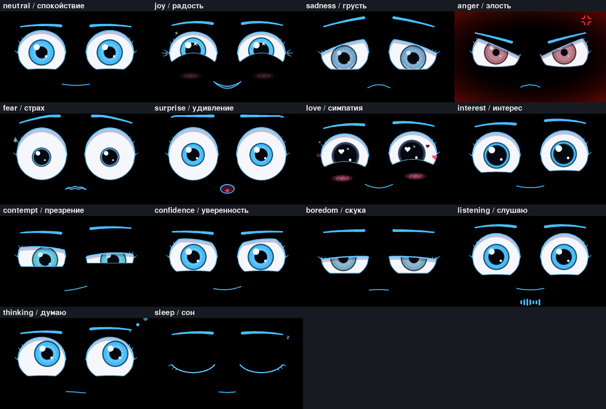

# Стелла — мини ИИ-ассистент с живыми глазами для Raspberry Pi 4


Стелла — голосовой помощник для Raspberry Pi 4 Model B. Она откликается на имя «Стелла», отвечает голосом
и показывает эмоции анимированными глазами на экране. У неё есть характер: она радуется комплиментам,
грустит вместе с вами, удивляется и пугается. Если ей грубить, она сначала обижается, потом злится
всерьёз и может отказаться выполнять просьбы, пока перед ней не извинятся.

Думает Стелла с помощью **Groq** (модель GPT-OSS 120B, есть бесплатный тариф) или **YandexGPT**.
Без ключей работает базовый набор: голос, будильники, списки,
погода, калькулятор, радио, игры и эмоции.

---

## Содержание
- [Эмоции](#эмоции)
- [Что умеет](#что-умеет)
- [Железо](#железо)
- [Установка](#установка)
- [Ключи и сервисы](#ключи-и-сервисы)
- [Шпаргалка голосовых команд](#шпаргалка-голосовых-команд)
- [Веб-панель, телефон, Windows/macOS](#веб-панель-телефон-windowsmacos)
- [Несколько Стелл в доме](#несколько-стелл-в-доме)
- [Сценарии умного дома](#сценарии-умного-дома)
- [Свои навыки](#свои-навыки)
- [Ограничения](#ограничения)
- [Как устроено](#как-устроено)
- [Решение проблем](#решение-проблем)

---

## Эмоции



Каждая эмоция задаётся набором параметров мимики. Это положение и наклон век, изгиб нижнего века,
размер зрачков, частота и скорость моргания, «бегающий» взгляд, положение бровей, «лучики» в уголках
глаз, румянец, слёзы, дрожь и рот. Между эмоциями лицо переходит плавно. Все параметры описаны
в `stella/face/emotions.py`.

| Эмоция | Как выглядят глаза |
|---|---|
| **Радость, счастье** | Глаза сужаются, нижнее веко поднимается дугой («улыбающиеся глаза»), в уголках появляются лучики-морщинки. Зрачки чуть шире, в глазах искорки и блеск, лёгкий румянец, лицо слегка подпрыгивает |
| **Грусть, печаль** | Взгляд опущен и расфокусирован, веки приопущены, внешние уголки глаз опускаются, внутренние концы бровей приподняты. В глазах стоят слёзы, иногда скатывается слезинка, цвет глаз тускнеет |
| **Гнев, злость** | Брови сведены к переносице и опущены, веки наклонены (`\ /`), глаза сужены, зрачки маленькие. Радужка краснеет, по краям экрана красное свечение, лицо подрагивает. В ярости появляется значок 💢 |
| **Страх, испуг** | Глаза широко раскрыты, над радужкой видна полоска белка. Зрачки резко расширены, взгляд мечется в поисках выхода, губы дрожат, выступает капелька пота |
| **Удивление** | Брови высоко подняты, глаза распахнуты, взгляд неподвижно устремлён на объект, рот буквой «О». Напряжения, как при страхе, нет |
| **Интерес, влюблённость, симпатия** | Зрачки сильно расширены, взгляд долгий, тёплый и сфокусированный на человеке, голова слегка наклонена, медленное мягкое моргание. Блики-сердечки, румянец, всплывающие сердечки (у «интереса» — без них) |
| **Презрение, отвращение** | Один глаз прищурен сильнее другого, одна бровь поднята. Взгляд «свысока» вниз и в сторону, один уголок рта кривится в ухмылке |
| **Уверенность, вызов** | Прямой открытый взгляд «глаза в глаза». Взгляд не бегает, почти нет морганий, брови чуть опущены, полуулыбка |
| **Усталость, скука** | Тяжёлые полуприкрытые веки, взгляд «сквозь» собеседника (глаза чуть разведены). Медленное моргание, нет блеска, тусклые глаза, иногда зевает |

Есть и служебные состояния: **слушаю** (внимательный взгляд и «эквалайзер» громкости микрофона),
**думаю** (взгляд вверх-вбок и мысленные пузырьки), **сон** (закрытые глаза и «Z-z-z»), **говорю**
(рот двигается в такт голосу).

### Откуда берутся эмоции
- **Ответы ИИ.** Нейросеть (Groq или YandexGPT) начинает каждый ответ тегом эмоции (`[joy]`, `[anger]`…),
  и глаза его показывают.
- **Тон собеседника.** Стелла различает комплименты, «спасибо», признания в любви, грусть («мне плохо»),
  страх, удивление («прикинь!»), вызов («спорим, ты не сможешь?») и отвращение («фу»).
- **Навыки.** Погода (солнце → радость, гроза → страх), игры (угадал → удивление, проиграла → грусть),
  будильник и т.п.
- **Характер и настроение** (`stella/face/emotion_engine.py`):
  - **Грубость копит раздражение (0–10).** Сюда же идут мат, повторение одного и того же и частые тычки
    в экран. 2+ — презрение и обида, 4+ — злость, 7+ — ярость: красное свечение, 💢, колкие ответы,
    отказ от «развлекательных» просьб (музыка, игры, болтовня), пока не извинишься. Важные команды
    (будильник, таймер, «стоп») выполняются всегда.
  - «Извини» и «прости» снижают раздражение. Без извинений Стелла остывает сама, примерно за 45 секунд
    на 1 пункт.
  - Комплименты копят симпатию, и взгляд становится теплее.
  - После 5 минут тишины Стелла скучает и зевает, после 30 минут засыпает. Ночью она сонная и говорит тише.
  - Касание экрана: одно — хихикает, пять подряд — злится («Я тебе не кнопка лифта!»).

Попросите: «Стелла, покажи эмоцию грусть», «покажи злость», «покажи все эмоции». Без микрофона
посмотреть все эмоции можно командой `python3 main.py --demo` (клавиша `D` включает и выключает демо,
`F` — полный экран, `Esc` — выход).

---

## Что умеет

Без интернета работают: голос, эмоции, будильники, таймеры, списки, заметки, калькулятор, игры и сказки.

| Возможность | Как сделано | Что нужно |
|---|---|---|
| Слово-активатор «Стелла», команда в одной фразе («Стелла, какая погода») | Vosk (офлайн); саму команду уточняет Groq Whisper | ключ Groq — для точного распознавания |
| Голос с эмоциями | Яндекс SpeechKit; офлайн — Piper (голос «Ирина»), RHVoice, eSpeak | ключ Yandex Cloud (необязательно) |
| **Шёпот**: заметит, что вы шепчете, и ответит шёпотом | детектор звонкости речи + роль `whisper` у голоса marina или DSP-эффект | — |
| Музыка, плейлисты, «Моя волна», жанры, подкасты, аудиокниги, лайки и дизлайки | Яндекс Музыка через mpv | токен Яндекс Музыки |
| Интернет-радио, любые подкасты (RSS), своя музыка, аудиокниги из Литрес (MP3) с запоминанием места | radio-browser.info, iTunes Search, папки | — |
| «Что за музыка играет?» | Shazam (shazamio), запасной вариант — AudD | — |
| Громкость, переключение треков, пауза, перемотка | PipeWire / PulseAudio / ALSA | — |
| Тексты, стихи, сценарии, письма, идеи; диалог с памятью и подстройкой под вас | Groq (GPT-OSS 120B) или YandexGPT + история диалога + факты о пользователе | ключ Groq или Yandex Cloud |
| Справка, поиск в интернете, переводы | Википедия, DuckDuckGo + пересказ нейросетью, Яндекс Переводчик или нейросеть | ключ — для перевода и пересказа |
| Калькулятор, единицы измерения, валюты и криптовалюты | свой разбор фраз, курсы ЦБ РФ, CoinGecko | — |
| Погода: сейчас, по часам, на день, выходные и неделю; осадки, закат, температура воды | Open-Meteo | — |
| Пробки в баллах 0–10 и время в пути, маршруты на машине, пешком и на велосипеде | TomTom (пробки), OSRM / FOSSGIS (маршруты) | ключ TomTom — только для пробок |
| Организации рядом, адреса, часы работы, «открыто сейчас», рейтинги | Яндекс «Поиск по организациям» или OpenStreetMap, 2ГИС | ключи — по желанию |
| Будильники (в том числе «по будням» и под музыку), таймеры, напоминания по времени и «когда приду домой», календарь | своё расписание; присутствие — по телефону в Wi-Fi; CalDAV (Яндекс Календарь) | — |
| Списки покупок и дел, заметки (синхронизация с телефоном) | SQLite + веб-панель + Telegram | — |
| Умный дом Яндекса и совместимых брендов: свет, розетки, чайники, пылесосы, ТВ, кондиционеры, датчики | API умного дома Яндекса, Home Assistant | OAuth-токен / HA |
| Сценарии: по фразе, по расписанию, по датчикам, при приходе домой; создание голосом | свой движок сценариев + сценарии Яндекса | — |
| Телевизор: включить и выключить, громкость, каналы, поиск фильмов | HDMI-CEC с Pi, ADB для Android TV и Яндекс ТВ, умный дом Яндекса | — |
| Радионяня (слушать с телефона или с другой Стеллы, тревога при плаче) | потоковый звук по WebSocket, уведомления | — |
| Мультирум — синхронная музыка во всех комнатах | Snapcast | вторая Pi со snapclient |
| Звонки между комнатами, звонок с телефона на колонку, «позвони мне» | двусторонний звук по WebSocket | — |
| «Найди мой телефон» | звонок через SIP (baresip) и/или громкое push-уведомление | SIP-аккаунт / Telegram / ntfy |
| Игры: города, викторина, «угадай число», загадки, «камень, ножницы, бумага»; сказки на ночь, анекдоты | встроено; с нейросетью — бесконечные вопросы и сказки | — |
| Сторонние навыки и боты: любой навык по протоколу Яндекс Диалогов, гороскоп, такси и еда (ссылкой) | webhook, ignio, Яндекс Go | — |
| Рецепты по шагам («дальше», «повтори», «назад», таймер прямо из шага) | встроенные рецепты + нейросеть | — |
| Новости и чтение вслух статей и веб-страниц | RSS, поиск новостей, trafilatura | — |
| Ассистент в браузере телефона и ПК, в Telegram, на Windows и macOS | веб-панель, бот, та же программа на ПК | — |
| Камера: глаза следят за лицом, радуются вашему приходу | OpenCV (необязательно) | камера |

---

## Железо

- **Raspberry Pi 4 Model B** (лучше 4 ГБ ОЗУ), карта microSD от 16 ГБ, блок питания 5 В 3 А.
- **Экран**: официальный 7" сенсорный (800×480) или любой HDMI-монитор. Можно маленький SPI-дисплей
  ST7789/ILI9341 (`display.backend: luma`).
- **Микрофон**: USB-микрофон или плата ReSpeaker 2-Mic/4-Mic HAT.
- **Динамик**: USB-колонка, 3,5 мм или HDMI.
- По желанию: камера (Pi Camera или USB), HDMI-кабель к телевизору (HDMI-CEC).

Рекомендуемая ОС: **Raspberry Pi OS (64-bit) Bookworm с рабочим столом**.

---

## Установка

```bash
git clone https://github.com/a1x10/project3.git
# пока ветка не влита в main: (cd project3 && git checkout claude/wizardly-knuth-nqz7ht)
cd project3/stella_assistant
bash deploy/install.sh
```

Скрипт:
1. ставит mpv, ffmpeg, PortAudio, SDL и eSpeak;
2. создаёт `.venv` и ставит Python-пакеты;
3. скачивает модель распознавания речи Vosk (45 МБ) и голос Piper «Ирина» (63 МБ);
4. создаёт `config.yaml` и `scenarios.yaml`;
5. включает автозапуск: на рабочем столе через `~/.config/autostart`, без рабочего стола — пользовательской
   службой systemd.

Ручной запуск и проверка:

```bash
.venv/bin/python main.py --windowed      # лицо в окне
.venv/bin/python main.py                 # на весь экран (как при автозапуске)
.venv/bin/python main.py --text          # писать команды в консоли
.venv/bin/python main.py --demo          # показ всех эмоций
.venv/bin/pip install -r requirements-dev.txt && .venv/bin/python -m pytest -q tests   # тесты
```

Если динамик или микрофон не выбрались сами, найдите их в списке `python3 -m sounddevice` и пропишите
в `config.yaml` (`audio.input_device`, `audio.output_device`) номер или часть имени.

---

## Ключи и сервисы

Всё необязательно. Ключи можно вписать в `config.yaml` или в `deploy/stella.env`
(пример — `deploy/stella.env.example`).

**Groq — «мозг» и распознавание речи (рекомендуется).**
1. Зарегистрируйтесь на [console.groq.com](https://console.groq.com), откройте **API Keys** и нажмите
   **Create API Key**.
2. Впишите ключ в `config.yaml` (`groq.api_key`) или в `deploy/stella.env` (`GROQ_API_KEY=…`).
   Ключ не нужно никому пересылать — он хранится только на вашей Pi.
3. Всё. Стелла будет думать моделью `openai/gpt-oss-120b` (если она станет недоступна —
   `qwen/qwen3.8-27b`, потом `openai/gpt-oss-20b`). Команды после слова «Стелла» будет уточнять
   Groq Whisper (`whisper-large-v3-turbo`). Само слово «Стелла» по-прежнему слушается офлайн, в облако
   уходит только фраза после него. Отключить облачное распознавание: `stt.cloud: off`.

На бесплатном тарифе у Groq есть лимиты запросов в минуту и в сутки; для домашнего ассистента их хватает.
Если из вашей сети Groq отвечает ошибкой 403, укажите прокси в `groq.proxy` (`http://…` или `socks5://…`;
для SOCKS выполните `.venv/bin/pip install "requests[socks]"`). Если заданы оба ключа, Groq и YandexGPT,
Стелла сама переключится на YandexGPT, когда Groq не отвечает (`llm.provider: auto`).

**YandexGPT, SpeechKit, Переводчик.** В [консоли Yandex Cloud](https://console.yandex.cloud):
1. Создайте каталог и сервисный аккаунт с ролями `ai.languageModels.user`, `ai.speechkit-tts.user`
   и `ai.translate.user`. Для облачного распознавания речи нужна ещё `ai.speechkit-stt.user`.
2. Создайте API-ключ сервисного аккаунта.
3. Впишите `yandex.api_key` и `yandex.folder_id` (ID каталога).

Модель по умолчанию — `yandexgpt-5-lite` (быстрая и дешёвая). Можно поставить `yandexgpt-5-pro`,
`yandexgpt-5.1` или `aliceai-llm`.

**Яндекс Музыка.**
1. Запустите `.venv/bin/python deploy/yandex_music_token.py`.
2. Откройте ссылку, введите код — скрипт покажет токен.
3. Впишите его в `yandex_music.token`. Для полных треков нужна подписка Плюс.

**Умный дом Яндекса.**
1. Зарегистрируйте приложение на [oauth.yandex.ru](https://oauth.yandex.ru/client/new/) с доступами
   `iot:view` и `iot:control`.
2. Запустите `.venv/bin/python deploy/yandex_iot_token.py <ClientID> <Client secret>`.
3. Впишите полученный токен в `smarthome.yandex_token`. Стелла увидит все устройства, комнаты
   и сценарии из приложения «Дом с Алисой».

**Home Assistant** (Xiaomi, Tuya, Sonoff, Philips Hue и любые другие бренды): адрес и долгоживущий
токен — в `smarthome.home_assistant`.

**Telegram.**
1. Создайте бота у [@BotFather](https://t.me/BotFather) и впишите токен в `telegram.token`.
2. Напишите боту `/start` — он пришлёт ваш ID. Добавьте ID в `telegram.allowed_users`.

**Пробки.** Бесплатный ключ на [developer.tomtom.com](https://developer.tomtom.com) → `traffic.tomtom_key`.

**Организации.** «API Поиска по организациям» в
[кабинете разработчика Яндекса](https://developer.tech.yandex.ru) → `places.yandex_geosearch_key`.
Без ключа поиск идёт по OpenStreetMap.

**Яндекс Календарь.** Пароль приложения на id.yandex.ru → `calendar.username` и `calendar.password`.

---

## Шпаргалка голосовых команд

Говорите «Стелла» и команду одной фразой, или сначала «Стелла», дождитесь сигнала, потом команду.
После вопроса Стеллы отвечайте без её имени.

- **Музыка:** «включи музыку» (Моя волна), «включи Кино», «включи песню Группа крови», «включи
  плейлист Для бега», «включи рок», «включи спокойную музыку», «включи радио Европа Плюс», «включи
  подкаст Медуза», «продолжи аудиокнигу», «дальше», «назад», «пауза», «продолжи», «перемотай на 30
  секунд», «перемешай», «лайк», «не нравится», «что сейчас играет», «громче», «громкость 7»,
  «сделай музыку тише».
- **Shazam:** «что за песня играет?»
- **Разговор и тексты:** «напиши стих про осень», «придумай сценарий для видео про кота», «составь
  письмо начальнику об отпуске», «дай идеи для подарка маме», «продолжай», «забудь наш разговор».
- **Память:** «меня зовут Саша», «запомни, что мой любимый цвет синий», «что ты обо мне знаешь»,
  «забудь всё обо мне».
- **Справка:** «кто такой Юрий Гагарин», «что такое квазар», «найди в интернете, когда вышел первый
  айфон», «переведи на английский я люблю кошек», «как будет «спасибо» по-немецки».
- **Счёт:** «сколько будет 25 умножить на 4», «корень из 144», «15 процентов от 200», «5 миль
  в километрах», «курс доллара», «100 долларов в рублях», «сколько стоит биткоин».
- **Погода:** «какая погода», «погода завтра», «погода в Сочи на выходные», «погода вечером»,
  «нужен ли зонт», «погода на неделю», «температура воды в Анапе», «когда закат», «что надеть».
- **Дороги и места:** «какие пробки», «сколько ехать до работы», «как дойти до парка Горького», «где
  ближайшая аптека», «до скольки работает Пятёрочка», «отзывы о ресторане …».
- **Время:** «разбуди меня в 7 утра», «будильник на 6:30 по будням», «разбуди под музыку в 8»,
  «отложи на 10 минут», «поставь таймер на 5 минут для пасты», «сколько осталось», «напомни завтра
  в 10 позвонить маме», «напомни, когда приду домой, купить хлеб», «создай событие: встреча с врачом
  в пятницу в 15», «что у меня завтра».
- **Списки:** «добавь молоко и хлеб в список покупок», «что купить», «вычеркни хлеб», «добавь
  задачу помыть машину», «запиши заметку …», «прочитай заметки».
- **Умный дом:** «включи свет на кухне», «выключи свет везде», «сделай свет теплее», «свет 50
  процентов», «включи чайник», «поставь кондиционер на 22 градуса», «запусти пылесос», «какая
  температура в спальне», «есть ли протечка», «запусти сценарий Кино», «создай сценарий: когда я
  говорю «я дома», включи свет и включи музыку».
- **Телевизор:** «включи телевизор», «громче на телевизоре», «переключи на 5 канал», «найди фильм
  Интерстеллар», «что посмотреть».
- **Дом и связь:** «включи радионяню», «послушай детскую», «позвони на кухню», «положи трубку»,
  «скажи на кухне: ужин готов», «объяви всем: выходим через 5 минут», «включи музыку везде»,
  «найди мой телефон», «позвони мне».
- **Игры:** «давай сыграем в города», «викторина», «угадай число», «загадай загадку», «камень,
  ножницы, бумага», «расскажи сказку про дракона», «расскажи анекдот», «подбрось монетку».
- **Другое:** «как приготовить блины» (потом «дальше», «повтори»), «новости», «новости про
  технологии», «прочитай статью про …», «гороскоп для Льва», «вызови такси до вокзала» (ссылка в
  Telegram), «запусти навык …».
- **Сама Стелла:** «стоп», «повтори», «говори шёпотом», «говори нормально», «спи», «проснись»,
  «покажи эмоцию удивление», «как дела», «что ты умеешь», «адрес панели».

---

## Веб-панель, телефон, Windows/macOS

Откройте `http://<IP Raspberry Pi>:8765`. Адрес Стелла назовёт сама по команде «адрес панели».

В панели есть:
- чат с текстом и голосом (кнопка 🎤);
- живое лицо Стеллы и кнопки эмоций;
- списки и заметки, синхронизированные со Стеллой;
- будильники и напоминания;
- музыкальный пульт;
- устройства умного дома и редактор сценариев;
- радионяня (`/baby`) и звонок на колонку (`/call`).

Если панель доступна не только из дома, задайте пароль `web.password`.

Микрофону в браузере нужен HTTPS. Включите `web.https: true` — Стелла создаст самоподписанный
сертификат, и браузер один раз попросит подтвердить исключение. Панель можно добавить на главный экран
телефона как приложение.

На **Windows, macOS или Linux-ПК** работает та же программа: установите Python 3.10+, mpv и ffmpeg,
выполните `pip install -r requirements.txt` и запустите `python main.py --windowed`. Telegram-бот
делает Стеллу доступной с телефона откуда угодно: можно писать текстом или отправлять голосовые,
и она ответит голосом.

---

## Несколько Стелл в доме

Поставьте Стелл в разные комнаты и пропишите друг друга в `peers`:

```yaml
peers:
  кухня: http://192.168.1.51:8765
  детская: http://192.168.1.52:8765
```

Если задан `web.password`, он должен совпадать на всех Стеллах.

Тогда работают:
- **Объявления:** «скажи на кухне: обед готов», «объяви всем: …».
- **Команды в другой комнате:** «включи музыку на кухне».
- **Звонки:** «позвони в детскую». Говорить можно в обе стороны, закончить — «положи трубку».
- **Радионяня:** в детской «включи радионяню», в спальне «послушай детскую».

**Мультирум** (синхронная музыка) работает на Snapcast:
1. На главной Стелле поставьте `snapserver` с источником `pipe:///tmp/snapfifo`, на остальных — `snapclient`.
2. Включите `multiroom.enabled: true`.
3. Скажите «включи музыку везде».

---

## Сценарии умного дома

Сценарии хранятся в `scenarios.yaml`; их можно редактировать в веб-панели (вкладка «Дом») или создавать
голосом. Примеры — в `scenarios.example.yaml`:

```yaml
scenarios:
  - name: Спокойной ночи
    triggers: [{phrase: спокойной ночи}]
    reply: Спокойной ночи! Выключаю свет.
    actions:
      - command: выключи свет везде
      - command: поставь будильник на 7:30
  - name: Свет ночью при движении
    triggers: [{sensor: Датчик движения в коридоре, property: motion, value: detected}]
    conditions: [{time_between: ["22:00", "07:00"]}]
    actions: [{command: включи свет в коридоре}, {delay: 120}, {command: выключи свет в коридоре}]
```

Триггеры:
- `phrase` — фраза;
- `time` + `days` — расписание;
- `sensor` — датчик (с условиями `value`, `above` или `below`);
- `presence: arrive` / `presence: leave` — пришли домой или ушли (по телефону в Wi-Fi, `presence.phone_ip`).

Действия:
- `command` — любая голосовая команда;
- `say` — сказать фразу;
- `emotion` — показать эмоцию;
- `delay` — пауза;
- `notify` — уведомление;
- `yandex_scenario` — сценарий из приложения Яндекса;
- `ha_service` — служба Home Assistant.

---

## Свои навыки

Положите `.py`-файл в папку `plugins/`. Пример — `plugins/new_year.py`:

```python
from stella.skills.base import Reply, Skill, intent

class Coin(Skill):
    name = "coin"

    @intent(r"\bподбрось монет", fun=True)
    def coin(self, ctx):
        return Reply("Орёл!", emotion="joy")
```

Навыки, работающие по протоколу Яндекс Диалогов (webhook), подключаются без кода:

```yaml
skills:
  webhooks:
    - name: мой навык
      activation: ["запусти мой навык"]
      url: https://example.com/alice-webhook
```

---

## Ограничения

- **Литрес** не даёт публичного API. Купленные книги можно скачать в MP3 и положить в
  `~/Audiobooks/<Название книги>/`. Стелла читает их по главам и запоминает место.
- **Каталог навыков Алисы** (такси, еда и тысячи других) работает только внутри Алисы. Стелла умеет
  запускать навыки по тому же протоколу, если у вас есть их адрес. Такси и еду Стелла не заказывает
  сама: она присылает ссылку в Telegram, и приложение Яндекс Go откроется с готовым маршрутом.
- **Пробки в баллах.** У Яндекса нет открытого API пробок, поэтому балл считается по данным TomTom:
  насколько медленнее обычного едут машины в нескольких точках города.
- **Напоминания по геолокации** срабатывают по присутствию: Стелла считает, что вы дома, когда ваш
  телефон подключён к домашнему Wi-Fi.
- **«Найди телефон».** Для настоящего звонка нужен SIP-аккаунт у любого провайдера телефонии. Без него
  Стелла присылает громкое push-уведомление.
- **Неофициальные библиотеки.** Яндекс Музыка и Shazam работают через них и могут ломаться при изменениях
  на стороне сервисов. Обновить их: `.venv/bin/pip install -U yandex-music shazamio`.
- **Шёпот.** Маленькая модель Vosk распознаёт шёпот хуже обычной речи. Говорите ближе к микрофону
  или добавьте ключ Groq — тогда команды распознаёт Whisper.

---

## Как устроено

```
main.py                      запуск: лицо (главный поток) + ассистент + веб-панель + Telegram
stella/
  config.py                  настройки (config.yaml + значения по умолчанию + переменные окружения)
  core/assistant.py          «дирижёр»: активатор → распознавание → навыки → нейросеть → ответ голосом
  core/memory.py             SQLite: диалог, факты о пользователе, списки, будильники, события, лайки
  core/scheduler.py          фоновые задачи (будильники, датчики, сценарии)
  core/events.py             шина событий между потоками
  face/emotions.py           эмоции как параметры мимики
  face/renderer.py           отрисовка глаз (pygame): веки, радужка, зрачки, брови, рот, эффекты
  face/face.py               анимация: моргание, саккады, плавные переходы, касания, MJPEG для веба
  face/emotion_engine.py     характер: раздражение, симпатия, скука, сон, реакции на тон
  audio/stt.py               Vosk + слово-активатор + детектор шёпота (+ Groq Whisper / SpeechKit)
  audio/tts.py               SpeechKit / Piper / RHVoice / eSpeak, эмоциональные роли, шёпот
  audio/dsp.py               громкость, детектор и синтез шёпота (LPC), сигналы, мелодии
  audio/player.py            музыкальный плеер на mpv (очередь, радио, аудиокниги, мультирум)
  audio/io.py                микрофон (общий для всех) и динамик с анимацией рта
  llm/groq.py, yandexgpt.py  клиенты Groq (чат + Whisper) и YandexGPT
  llm/brain.py               характер, память, эмоции, «КОМАНДА:» и «ПОИСК:», переключение Groq → YandexGPT
  nlp/                       русские числительные, даты и время («без пятнадцати восемь»), стемминг
  skills/                    навыки (у каждого — регулярные выражения и обработчики)
  web/                       веб-панель (aiohttp) и страницы /baby, /call
  integrations/              Telegram, уведомления, связь со Стеллами в других комнатах, камера
plugins/                     ваши навыки
deploy/                      установка, автозапуск, получение токенов
tests/                       тесты (pytest)
```

**Как обрабатывается фраза.** Текст нормализуется: «двадцать пять» → «25». Дальше:
1. активная сессия (игра, рецепт, внешний навык) получает фразу первой;
2. если её нет — навыки по шаблонам в порядке приоритета;
3. если ни один не подошёл — нейросеть (Groq или YandexGPT).

ИИ может вернуть «КОМАНДА: …», если понял, что вы просите действие, сказанное своими словами
(«как-то темно тут» → «включи свет»). Если нужны свежие данные, он возвращает «ПОИСК: …», и Стелла
ищет в интернете.

---

## Решение проблем

| Проблема | Что сделать |
|---|---|
| Нет звука | `speaker-test -t wav`; выберите вывод в настройках рабочего стола или `audio.output_device` |
| Не слышит | `python3 -m sounddevice`, затем `audio.input_device`; уровень микрофона — `alsamixer` (F4) |
| Путает слово-активатор | добавьте варианты в `assistant.wake_words`; говорите громче и ближе |
| Медленно рисует | `display.supersample: 1`, `display.fps: 25` |
| «Мой облачный мозг недоступен» | проверьте `groq.api_key` (или `yandex.api_key` и `yandex.folder_id`); при ошибке 403 от Groq задайте `groq.proxy` |
| Музыка из Яндекса не играет | обновите токен (`deploy/yandex_music_token.py`); проверьте, что `mpv` установлен |
| Журнал | при автозапуске — `data/stella.log`; для службы — `journalctl --user -u stella -f` |
