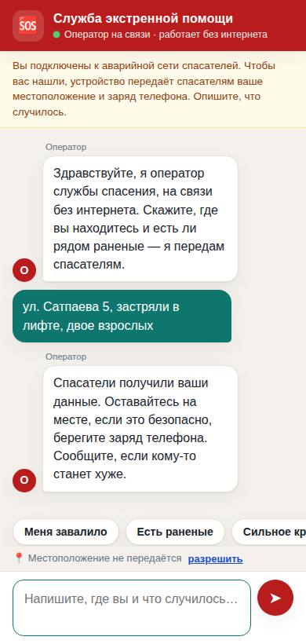
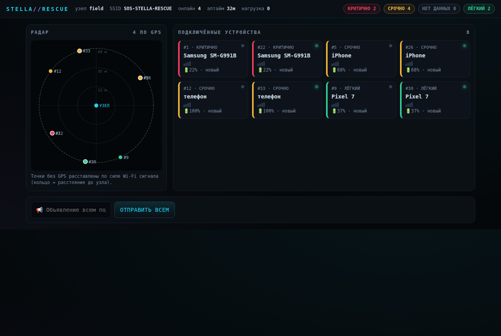
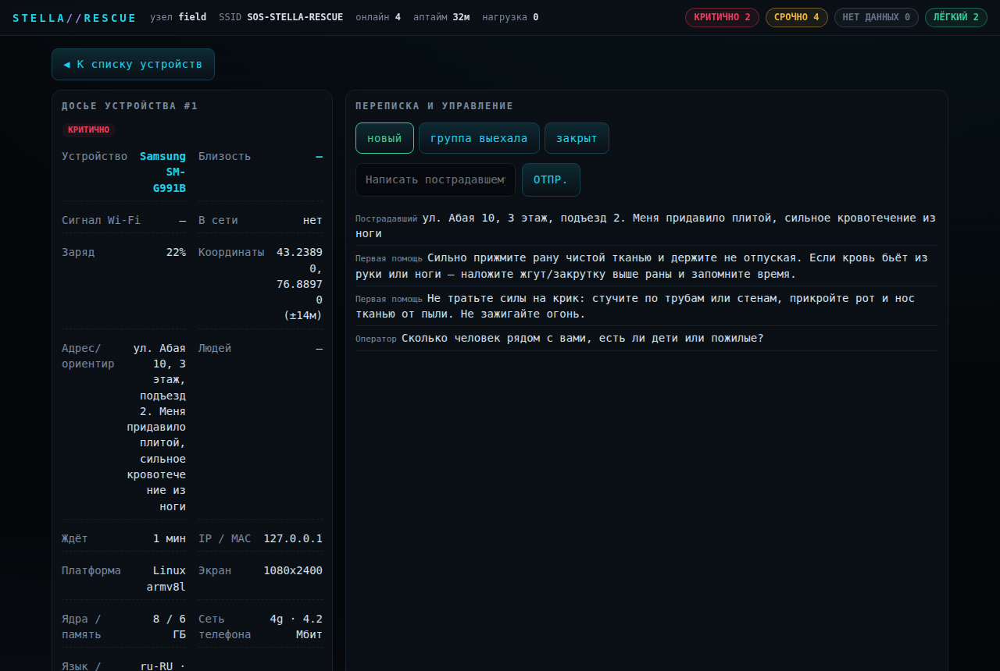

# Stella Pocket Rescue

Карманный автономный ИИ-хаб для координации спасательных работ, когда нет ни интернета, ни сотовой связи.
Целевое железо: **Orange Pi 4 LTS (RK3399, 4 ГБ ОЗУ, 16 ГБ eMMC)**, питание от powerbank.

```
 Телефоны пострадавших                    Orange Pi 4 LTS (10.42.0.1)
 ┌──────────┐   Wi-Fi "SOS-STELLA-RESCUE" ┌──────────────────────────────────────────────┐
 │ браузер  │ ──────────────────────────▶ │ hostapd   — открытая точка доступа (2.4 ГГц) │
 │ (чат)    │   DHCP + DNS: любой домен   │ dnsmasq   — DHCP, DNS "всё -> 10.42.0.1",    │
 └──────────┘   -> 10.42.0.1              │             DHCP option 114 (captive portal) │
                                          │ iptables  — DNS/HTTP на хаб, SSH закрыт      │
 Планшет/телефон спасателя                │ nginx :80 — любой Host -> FastAPI            │
 ┌──────────┐   /rescuer + PIN            │ FastAPI   — портал, триаж, SQLite, API       │
 │ карта +  │ ──────────────────────────▶ │   ├─ triage.py  правила START (без ИИ)       │
 │ очередь  │                             │   └─ llm.py ──▶ llama-server :8081           │
 └──────────┘                             │                 Qwen2.5-1.5B Q4_K_M (CPU)    │
                                          └──────────────────────────────────────────────┘
```

| Чат пострадавшего | Консоль оператора | Досье устройства |
|---|---|---|
|  |  |  |

## Как это работает

1. **Автономная связь.** Плата поднимает открытую сеть `SOS-STELLA-RESCUE`.
2. **Captive portal.** Телефон при подключении проверяет интернет (`connectivitycheck.gstatic.com`,
   `captive.apple.com`, …). DNS отвечает адресом хаба на *любой* домен, бэкенд отвечает редиректом —
   и ОС сама открывает окно с чатом. Дополнительно DHCP option 114 (RFC 8910) прямо сообщает адрес портала.
3. **Офлайн-диспетчер.** Локальная модель Qwen2.5 через `llama.cpp` ведёт диалог: спокойно, по одному
   вопросу, сначала «где вы», потом «есть ли раненые», потом «сколько людей».
4. **Триаж.** Каждое сообщение прогоняется через правила по мотивам START (`app/triage.py`):
   🔴 критично / 🟡 срочно / 🟢 лёгкий / ⚪ нет данных. Спасатель видит очередь и карту на `/rescuer`.

## Определение местоположения и мониторинг подключений

Задача — найти человека максимально точно, даже без GPS. Используется всё, что честно
доступно офлайн:

1. **Сила Wi-Fi сигнала → близость.** Хаб опрашивает точку доступа
   (`iw dev wlan0 station dump`) и для каждого телефона знает RSSI (dBm). По модели
   затухания это переводится в грубое расстояние и метку «рядом / близко / далеко /
   на пределе» (`app/stations.py`). Работает всегда, пока телефон в сети — GPS не нужен.
2. **Геолокация браузера.** Если человек разрешил доступ, страница держит `watchPosition`
   и фоном шлёт координаты (`/api/heartbeat`) — спасатель видит точку и её движение.
   Если не разрешил (браузеры отдают GPS только по HTTPS) — принимаются координаты текстом
   из приложения карт и описание ориентиров.
3. **Данные телефона.** При подключении страница честно передаёт модель устройства
   (из User-Agent — «чей это телефон»), заряд батареи и статус зарядки (чтобы понять,
   не сядет ли телефон раньше помощи), экран, ядра/память, язык, часовой пояс, тип сети.
   Заряд обновляется в фоне. Пользователю это прямо сообщается баннером на странице.

### Консоль спасателя `/rescuer` (офлайн)

Тёмная консоль реального времени:

- **Узел → сканирование.** Клик по карточке узла запускает 3-секундную анимацию
  подключения (лог + радар), после чего открывается сетка всех подключённых устройств.
- **Сетка устройств.** Каждый бокс — телефон: модель, приоритет (цветом), полоски сигнала,
  заряд, индикатор «в сети». Клик по боксу открывает досье.
- **Досье устройства.** Всё собранное в одном месте: близость и расстояние, сигнал, MAC/IP,
  координаты, адрес-ориентир, число людей, заряд, модель/платформа/экран/сеть, теги травм,
  полная переписка, ответ напрямую и смена статуса.
- **Радар.** Центр — узел. Телефоны с GPS проецируются по координатам, остальные ставятся
  на кольцо по расстоянию из сигнала. Кольца подписаны в метрах.
- **Верхняя панель.** SSID, аптайм и нагрузка узла, число онлайн, счётчики по приоритетам.

Всё это работает без интернета — и у пострадавших, и у спасателя, в одной локальной сети.
Отдельная ссылка `/rescuer` под PIN — только для вас; обычных людей captive portal
приводит на чат `/`.

### Важные инженерные решения (их стоит показать на защите)

| Решение | Почему |
|---|---|
| **Приоритет считает не нейросеть, а правила** | Модель 1.5B может ошибиться или «зависнуть». Сортировка людей должна быть объяснимой и воспроизводимой — у каждого вызова видны теги, из-за которых он поднят. |
| **Паника не повышает приоритет** | `ПОМОГИТЕ!!!` капсом не должен обогнать тихое «у отца сильное кровотечение». Паника показывается спасателю отдельной меткой. |
| **Первая помощь — мгновенно и без ИИ** | Совет «прижмите рану» появляется сразу, а не через 30 секунд генерации. Тексты фиксированные — модель не может придумать опасный совет. |
| **Резервный диспетчер** | Если модель занята (очередь > 3), упала или не ответила за 90 с — отвечает детерминированный диспетчер. Система работает даже вообще без ИИ. |
| **Ответ ИИ асинхронно** | POST сразу возвращается, ответ приходит через опрос. Окно captive portal не «висит» во время генерации. |
| **Факты накапливаются** | Адрес из 1-го сообщения, число людей из 2-го и травма из 3-го собираются в одну карточку. |
| **Безопасность открытой сети** | PIN спасателя (6 цифр, блокировка IP после 5 ошибок), SSH/модель/бэкенд недоступны из Wi-Fi, лимит запросов в nginx, весь вывод через `textContent` (нет XSS), логи nginx с IP выключены. |
| **SQLite в режиме WAL** | Данные переживают внезапное отключение питания. |

## Подходит ли Orange Pi 4 LTS

**Да, для прототипа подходит.** Что нужно учитывать:

- **Скорость ИИ.** GPU Mali-T860 для `llama.cpp` бесполезен, всё считается на CPU.
  Порядок скорости для Qwen2.5-1.5B Q4 на двух ядрах Cortex-A72 — единицы токенов в секунду,
  то есть ответ из 1–3 предложений занимает десятки секунд. Поэтому ответы короткие (`max_tokens=120`),
  а первая помощь и триаж работают без модели. Точные цифры снимите сами после установки:
  `llama-bench -m /opt/stella/models/model.gguf -t 2` (и сравните `-t 4`, `-t 6`).
  Модель 0.5B быстрее в 2–3 раза, но заметно хуже понимает русский.
- **Питание — главный риск.** Плате нужно **5 В / 4 А**. Обычный powerbank с USB-A 5 В/2 А под нагрузкой
  (ИИ + Wi-Fi) даст просадки и перезагрузки. Нужен powerbank, который отдаёт **5 В 3 А по USB-C**
  (Type-C вход платы не договаривается о PD 9/12 В — берётся только 5 В), либо DC-кабель 5 В/4 А.
  Потребление в работе порядка 5–8 Вт → powerbank 20 000 мА·ч хватит примерно на 8–10 часов (проверьте замером).
- **Охлаждение.** RK3399 под постоянной нагрузкой троттлит — нужен радиатор, лучше с вентилятором
  (корпус с блоком питания из объявления — проверьте, есть ли в нём радиатор).
- **Дальность и число клиентов.** Встроенный модуль AP6256 с маленькой антенной — это десятки метров
  в здании и ограниченное число одновременных клиентов в режиме точки доступа (порядка 10).
  Для полевого варианта: внешняя антенна, USB Wi-Fi адаптер с поддержкой AP-режима или копеечный
  роутер на OpenWrt, подключённый к Ethernet-порту платы (тогда hostapd не нужен, а dnsmasq/nginx остаются).
- **Про цену.** 40 000 ₽ за Orange Pi 4 LTS 4 ГБ — это сильно выше обычной рыночной цены такой платы;
  сравните предложения на маркетплейсах. Если бюджет действительно ~40 000 ₽, разумнее взять
  **Orange Pi 5 (RK3588S, 8–16 ГБ)**: у него 4 ядра A76 — модель будет отвечать в несколько раз быстрее,
  а код проекта переносится без изменений (поменять `LLAMA_CPUS`/`LLAMA_THREADS` в `stella.env`).

## Установка на Orange Pi

1. Запишите на microSD или eMMC **Armbian (Debian/Ubuntu, arm64)** или официальный Orange Pi OS
   для Orange Pi 4 LTS. Загрузитесь, подключите плату к интернету **по Ethernet**.
2. Скопируйте проект и запустите установщик:
   ```bash
   git clone <этот репозиторий> && cd project3/stella_pocket_rescue
   sudo ./deploy/install.sh              # модель 1.5B (≈1.1 ГБ)
   # или: sudo MODEL=0.5b ./deploy/install.sh
   ```
   Установщик поставит пакеты, соберёт `llama.cpp` (≈15–25 минут), скачает модель, настроит Wi-Fi,
   DNS, nginx, systemd и **выведет PIN спасателя** (хранится в `/etc/stella/stella.env`).
3. При желании впишите координаты места установки хаба в `/etc/stella/stella.env`
   (`STELLA_HUB_LAT`, `STELLA_HUB_LON`) — это центр карты.
4. `sudo reboot`. Дальше интернет не нужен.

После загрузки:
- пострадавшие подключаются к `SOS-STELLA-RESCUE` — чат открывается сам (или вручную `http://10.42.0.1/`);
- спасатели открывают `http://10.42.0.1/rescuer` и вводят PIN;
- администрирование — по SSH только через Ethernet (из Wi-Fi SSH закрыт).

Полезные команды:
```bash
systemctl status stella-app stella-llm hostapd dnsmasq
journalctl -u stella-app -f
curl http://127.0.0.1:8081/health   # модель загружена?
```

## Запуск на ноутбуке (разработка / демонстрация)

```bash
cd stella_pocket_rescue
python3 -m venv .venv && . .venv/bin/activate
pip install -r requirements-dev.txt
pytest                                           # 20 тестов: триаж, API, captive portal
STELLA_RESCUER_PIN=1234 uvicorn app.main:app --reload
# чат:      http://localhost:8000/
# спасатели: http://localhost:8000/rescuer  (PIN 1234)
```
Без запущенной модели работает резервный диспетчер. Чтобы подключить ИИ локально, соберите `llama.cpp`
и запустите `llama-server -m model.gguf --port 8081`.

## Структура

```
app/
  main.py        API, captive portal, фоновые ответы диспетчера, доступ спасателей
  triage.py      правила триажа, извлечение адреса/координат/числа людей, первая помощь
  llm.py         клиент к llama-server, очередь и таймауты
  db.py          SQLite (WAL)
  config.py      настройки из переменных окружения
  static/index.html    чат пострадавшего (без внешних библиотек, работает на старых телефонах)
  static/rescuer.html  панель спасателя: очередь, офлайн-карта, переписка, объявления всем
deploy/
  install.sh, hostapd.conf, dnsmasq-stella.conf, nginx-stella.conf, stella-net.sh,
  stella.env.example, systemd/*.service
tests/           pytest
```

## API

| Метод | Путь | Кто |
|---|---|---|
| POST | `/api/session` | пострадавший — получить id сессии, передать данные телефона `{device:{…}}` |
| POST | `/api/chat` | пострадавший — `{session_id, text, lat?, lon?, accuracy?}` |
| POST | `/api/heartbeat?session_id=` | пострадавший — фоновый заряд/координаты `{battery, charging, lat, lon}` |
| GET | `/api/messages?session_id=&after=&after_broadcast=` | пострадавший — новые сообщения и объявления |
| GET | `/api/rescuer/incidents` | спасатель (заголовок `X-Rescuer-Pin`) — очередь + сигнал/близость/онлайн |
| GET | `/api/rescuer/connections` | спасатель — живые подключения к Wi-Fi (MAC, сигнал, близость) |
| GET | `/api/rescuer/incidents/{id}/messages` | спасатель — переписка |
| PATCH | `/api/rescuer/incidents/{id}` | спасатель — `{status: new/assigned/resolved, note}` |
| POST | `/api/rescuer/incidents/{id}/reply` | спасатель — написать пострадавшему напрямую |
| POST | `/api/rescuer/broadcast` | спасатель — объявление всем подключённым |
| GET | `/api/health` | состояние, работает ли модель |

## Ограничения (честно)

- **Геолокация.** Браузеры отдают GPS только по HTTPS, а портал работает по HTTP (сертификат для
  офлайн-сети без предупреждений получить нельзя). Поэтому кнопка «Отправить геопозицию» часто не сработает —
  тогда человек присылает координаты из приложения карт текстом (они распознаются) или описывает
  адрес/этаж/ориентиры. Пострадавшие без координат всё равно находятся в радиусе Wi-Fi хаба (~50–100 м).
- Правила триажа — эвристика по ключевым словам, а не медицинская диагностика. Решение всегда за спасателем.
- Один хаб покрывает одно здание/двор. Для большой зоны нужно несколько хабов и синхронизация между ними
  (например, через LoRa или mesh) — это следующий шаг проекта.
- Прототип не сертифицирован и не заменяет штатные средства связи МЧС.
