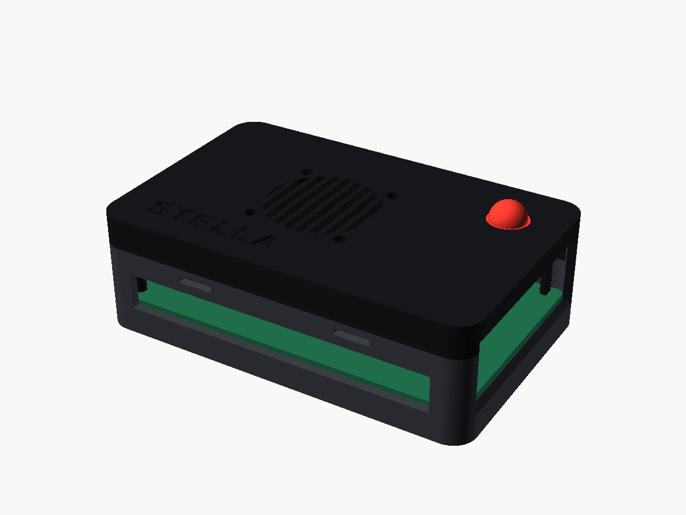

# Корпус Stella Pocket для 3D-печати

Файл модели: `stella_case.scad` (бесплатная программа OpenSCAD, openscad.org).

## Детали

| part | что это | чем печатать |
|---|---|---|
| `test` | тестовая рамка, ~15 минут | любой пластик |
| `base` | основание с окнами под разъёмы | тёмный PLA/PETG |
| `lid` | крышка-защёлка, решётка кулера, гнездо лампочки | тёмный PLA/PETG |
| `dome` | колпачок лампочки SOS | белый или прозрачный |

`all` — собранный корпус, `exploded` — разнесённый вид (только для просмотра).

## Как получить STL

Готовые файлы уже лежат в папке `stl/` (`test.stl`, `base.stl`, `lid.stl`, `dome.stl`) —
их можно сразу открыть в слайсере. OpenSCAD нужен, только если меняете размеры.



1. Откройте `stella_case.scad` в OpenSCAD.
2. В строке `part = "all";` поставьте нужную деталь, например `part = "test";`.
3. Нажмите F6 (рендер), затем File → Export → Export as STL.
4. Повторите для `base`, `lid`, `dome`.

## Печать

PLA или PETG, слой 0,2 мм, заполнение 20 %, стенки 3 периметра, **без поддержек**.
Крышка уже развёрнута верхом на стол. Для оранжевого «шва» как на презентации:
в слайсере добавьте смену пластика (M600 / Pause) на первых 2 мм крышки.

## Порядок

1. **Сначала `test`.** Положите плату на рамку: штырьки должны попасть в крепёжные
   отверстия, разъёмы — в вырезы. Не совпало — поправьте в начале файла:
   `pins` (отверстия), `windows` (окна разъёмов), `clr` (зазор, по умолчанию 0,5 мм).
2. Печатайте `base`, `lid`, `dome`.
3. Плату вставляйте с наклоном: сначала краем с USB-C/HDMI в его окна, потом опустите
   на стойки.
4. Кулер 30×30 прикрутите к крышке изнутри винтами M3 (или M2.5 саморезами),
   провода — на 5V и GND, как сейчас.
5. Светодиод вставьте в трубку снизу крышки, сверху наденьте колпачок `dome`.
6. Прижмите крышку до щелчка. Снять — поддеть ногтем у длинной стороны.

Если кулер или лампочка мешают деталям на плате — сдвиньте `fan_pos` и `led_pos`.

## Что купить

- красный светодиод 5 мм;
- резистор 330 Ом (подойдёт 220–470 Ом);
- 2 провода Dupont «мама»;
- 4 винта M3×10 для кулера;
- 4 резиновые ножки-наклейки Ø10 мм (по желанию).

## Подключение лампочки

```
GPIO-пин ──[330 Ом]──► длинная ножка (+)  светодиод  короткая ножка (−) ── GND
```

Любой свободный GPIO на 26-пиновой гребёнке и соседний GND. Номер для Linux узнайте
командой `sudo gpioinfo` или по распиновке Orange Pi 4 LTS (**проверить** перед
подключением), затем впишите его в `/etc/stella/stella.env`:

```
STELLA_LED_GPIO=номер
```

и выполните `sudo systemctl restart stella-hw`. В режиме ожидания лампочка коротко
вспыхивает раз в 3 секунды, в режиме ЧС часто мигает.

> Размеры платы и положения разъёмов взяты по памяти и не сверены с официальным
> чертежом — поэтому обязательно начинайте с тестовой рамки.
